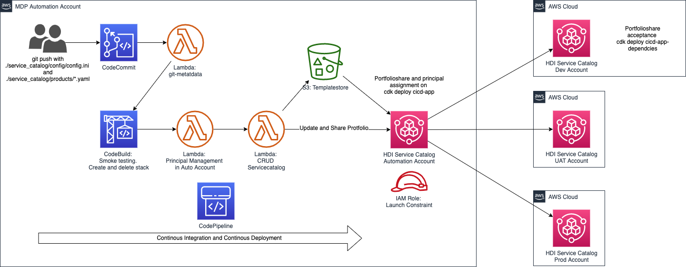
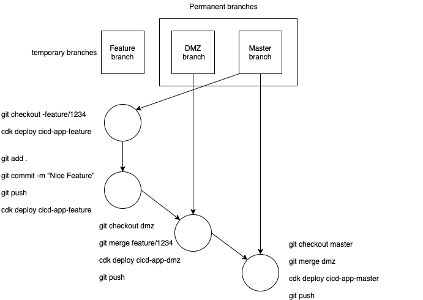
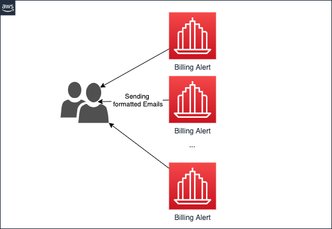
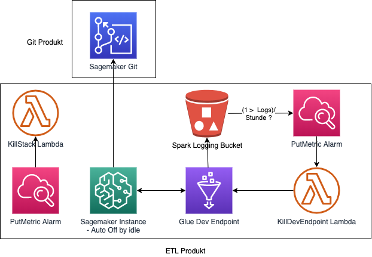
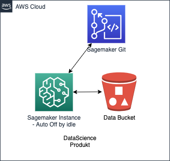

# CICD Pipeline for HDI Service Catalog

## Description

* This repo contains a CDK app for the CICD pipeline for the HDI Service Catalog.
* Every product for the Service Catalog will be an additional part of this app.
* `Attention`: This `CICD pipeline` will only succeed if the commit contains a file within the pattern: `service_catalog/config/*.yaml`.
* The CDK App is built and tested with aws-cdk and it's dependencies at version 1.49.

## Purpose

* Deploying AWS Infrastructure without IAM Permissions.
* Providing tested AWS Infrastructure as CloudFormation template.
* Delete deprecated products and product versions.

## Architecture



## Getting started

* Fullfill a SwitchRole on your CLI with `aws-mfa` or `awsume` or any other mechanism.
* This is a `Python CDK App`:
    * `source .env/bin/activate`
    * `pip install git-remote-codecommit`
* Now, you can use `git clone codecommit::eu-central-1://hd-auto-service-catalog`
* Finally, run `pip install -r requirements.txt` and `pre-commit install`.
* Take a look at `.pre-commit-config.yaml`. This file configures the [pre-commit hook](https://pre-commit.com/). This ensures a certain quality level of the Python code in this repo. Additionally, [cfn-lint](https://github.com/aws-cloudformation/cfn-python-lint) and [cfn_nag](https://github.com/stelligent/cfn_nag) runs test against all template before they will be checked in.

## Branching concept



* We run this app with to permanent branches, called `master` and `dmz`.
* A new feature will introduced by `git checkout -b feature/1234`. Do your stuff to implement this feature.
* Test your feature with `cdk deploy hd-auto-service-catalog-feature`. In a first new CICD will be build. Run your changes over this CICD.
* Ready? `git push` your changes, merge them into `dmz` branch and redeploy `cdk deploy hd-auto-service-catalog-dmz`.
* DO the same afterwards with the `master` branch.

## Code evaluation

* Before you can push your code, it will be evaluated by the pre-commit hook. We use black and flake to check PEP8 guidelines.
* We also use genral code formatting steps, like an empty line of a file.
* The hook also checks whether docstring are implemented or not.
* Finally, `CloudFormation` templates under `service_catalog/products/*` will be linted and will check be evaluated to common best security practises.
* If everything is fine, you can run `git push`. If something fails, you need to re run `git add .` and `git commit -m "FooBar"`.

## Usage

* Create with this Repo your `stack.py` under `service_catalog`.
* Configure `app.py`:

```python
from aws_cdk import core
from service_catalog.service_catalog_cicd_stack import ServiceCatalogCICDStack
from service_catalog.custom_vpc import CustomVpcStack
# Added service
from service_catalog.YOUR_STACK_HERE import YOUR_CLASS_HERE

app = core.App()

ServiceCatalogCICDStack(app, "hd-auto-service-catalog")
CustomVpcStack(app, "custom-vpc")
# Added service
YOUR_CLASS_HERE(app, YOUR_STACK_NAME)

app.synth()
```

* Run `cdk synth "YOUR_STACK_NAME" > service_catalog/products/*.yaml`

## Configuration

* Enhance `service_catalog/config/config_{}.ini` accordingly to your product. Choose a human friendly name for the product! The section name and
* All fields in `config_{}.ini` are necessary.
* To deprecate a product, delete the corresponding section within `config.ini`. The deletion takes place, while a new product or an updated version of existing product will be pushed.

## Restrictions

* Due to IAM Role settings, we cannot protect certain branches.
* Use `feature/name_of_feature` for development.
* Use `dmz` branch for testing.
* Only the `master` will be shared with other accounts.
* So far, only the latest version of the product will be provided through the `Service Catalog`.
* You can use `"\\*_{}[]()>#+-.!$/"` within your `FILE_NAME`. For comparision, all these special characters will be replaced.
* The same applies to `Name` and `Section ([foo_bar.yaml])` within `service_catalog/config/config.ini`. But you need to take the same letters in the same order for both parameters.
* If you need assets, you need to add those assets within `service_catalog_cicd_stack.py`.
* So far, the deployment of multiple *.yaml-files at once is not supported. Also, a commit with a deletion and a new/updated *.yaml-file will not work. We are working on this ...

```yaml
[custom_vpc.yaml]
...
Name: CustomVPC or Custom_VPC or Custom-VPC or customvpc # does not matter
...
```

## Products exmaples







## Inspiration/Source

* [Old AWS Blogpost](https://aws.amazon.com/blogs/devops/aws-service-catalog-sync-code/)
* [And its Repo](https://github.com/aws-samples/aws-pipeline-to-service-catalog)
